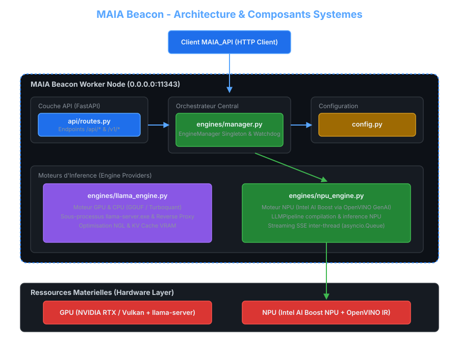
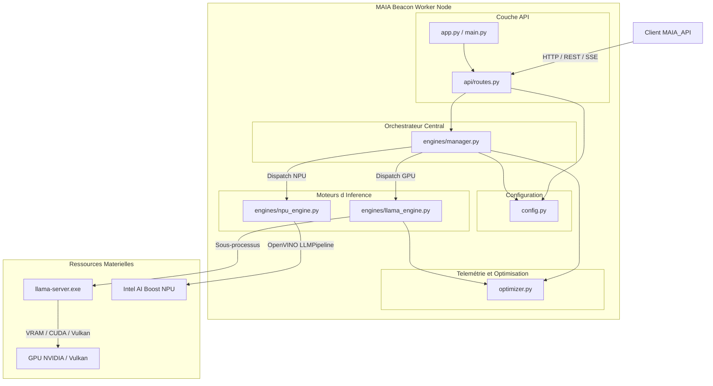
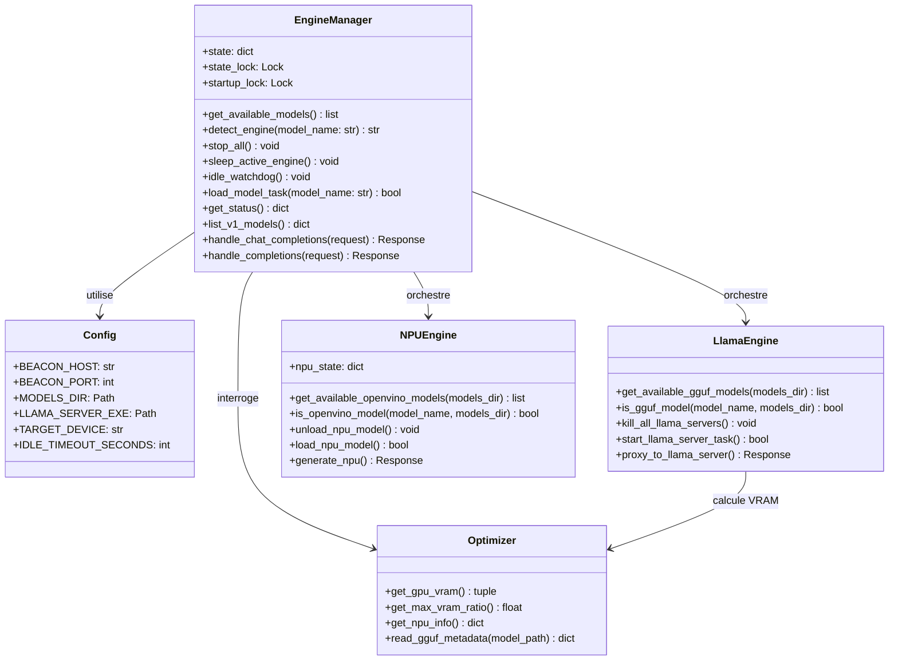
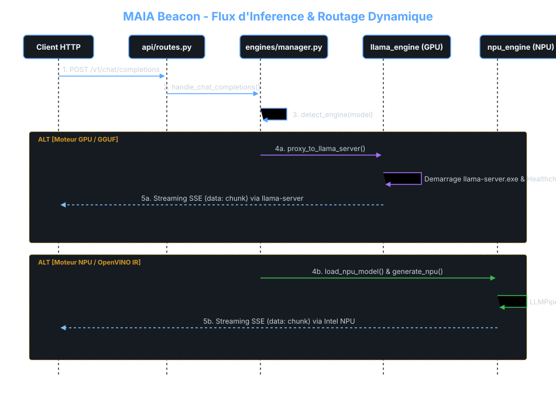
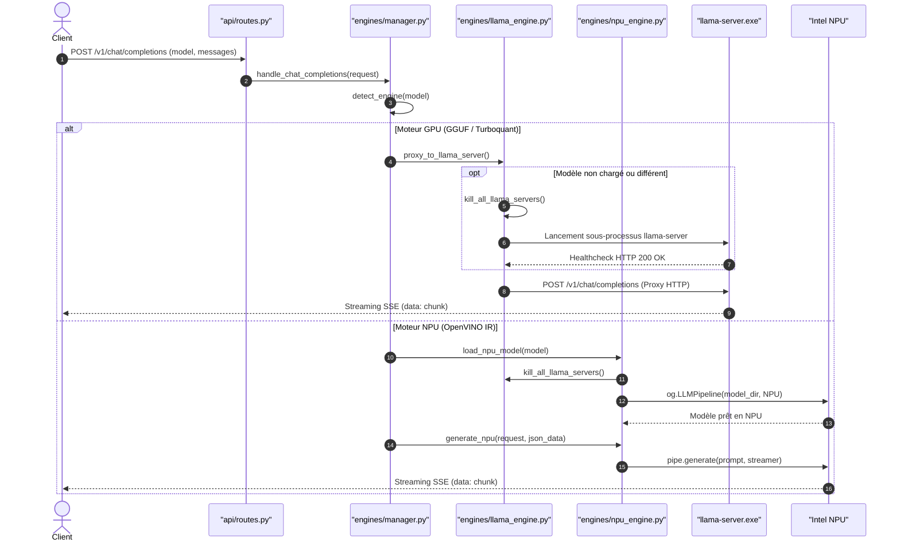
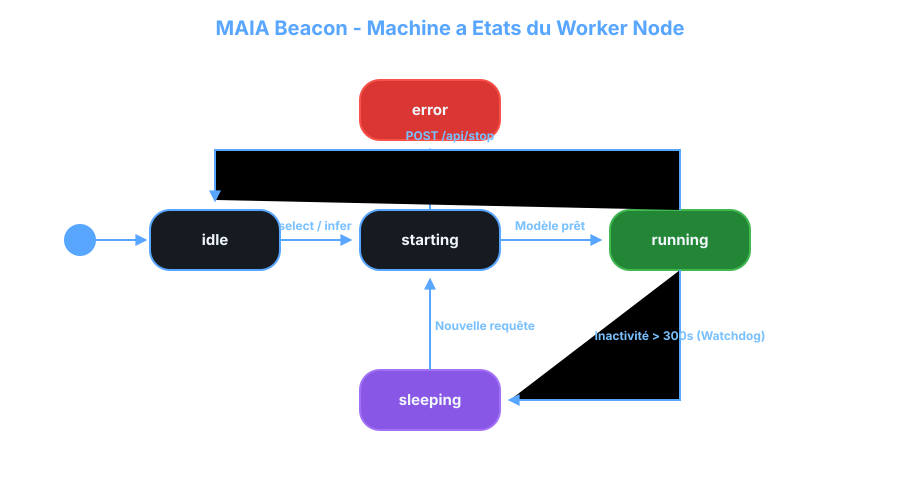
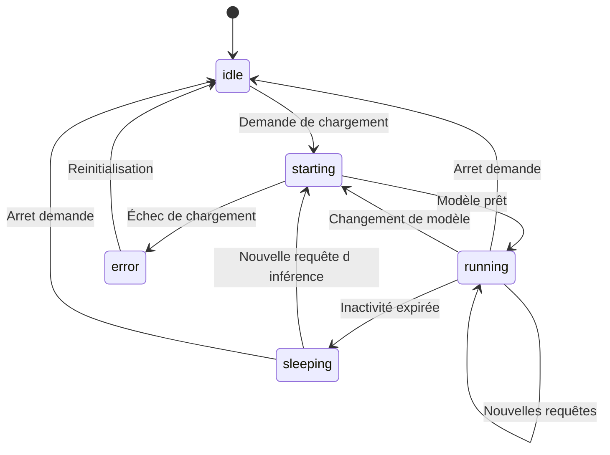

# MAIA Beacon - Diagrammes UML & Architecture

Ce document rassemble les diagrammes UML décrivant l'architecture modulaire, la structure des classes, les séquences d'inférence et la machine à états de **MAIA Beacon**.

---

## 1. Diagramme de Composants (Component Diagram)

Ce diagramme illustre le découplage entre la couche d'API HTTP (`api.routes`), l'orchestrateur central (`engines.manager`), les fournisseurs d'exécution matériels (`engines.llama_engine` et `engines.npu_engine`) et le module d'optimisation matérielle (`optimizer`).

<b>Voir le code Mermaid</b>

---

## 2. Diagramme de Classes (Class Diagram)

Ce diagramme présente la structure orientée objet de l'orchestrateur `EngineManager` et ses interactions avec les sous-modules.

---

## 3. Diagramme de Séquence : Inférence Chat `/v1/chat/completions`

Ce diagramme montre le flux de traitement d'une requête de chat OpenAI, incluant la détection du matériel, le chargement dynamique et le streaming SSE.

<b>Voir le code Mermaid</b>

---

## 4. Diagramme d'États (State Machine Diagram)

Ce diagramme décrit les transitions d'états de l'orchestrateur `EngineManager.state["status"]`.

<b>Voir le code Mermaid</b>

